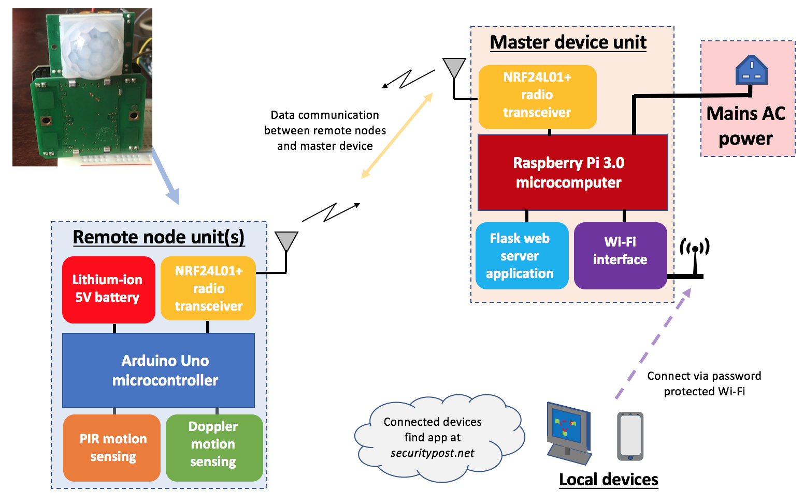

# **INTRUSION MONITORING SYSTEM - README** 

----------

## INTRODUCTION 

The intrusion monitoring system is built using a combination of many technologies, both hardware and software, to create a robust and reliable system that makes detections of intruders or motion at a chosen location. 

The system makes use of remote detection nodes, each of which uses an Arduino UNO microcontroller, an nRF24L01+ radio transceiver, a custom-built HB100 X-Band Radar Doppler motion sensor, and a Passive Infrared (PIR) motion sensor. These nodes are designed to continuously monitor for motion and presence at a chosen remote location and return the detection states regularly to a centralised master device.

The master device within this project has been made multiple times, to demonstrate the different possibilities for a system that uses the data sent from the remote nodes. 

1. The first, and more basic design, makes use of an Arduino MEGA microcontroller, with an LCD screen for display, an nRF24L01+ radio transceiver for radio communications, and many LEDs/audible alarms and buttons for different control/display interfaces for an operator. 

2. The second, more advanced design, uses a Raspberry Pi microcomputer to create a full web server application. This application is built using Python and the Flask micro-framework, along with various external libraries. HTML, CSS and JavaScript are used for client side design, including usage of the Materialize CSS framework for enhanced front-end compatibility and display. A manually configured baseline installation of Raspbian Linux is used with the Raspberry Pi to achieve this design. A great feature added to this design was the ability to host a local WiFi hotspot, which allows authenticated users to log onto the Intrusion monitoring app and view its status.



----------

## ACCESSING THE APPLICATION/SYSTEM

To setup the system for use, you'll need to acquire several Arduino microcontrollers, nRF24L01+ transceivers and associated X-Band Radar sensors / PIR sensors. If you only want to test the concepts of this system, or adapt it completely to your own use-case, you can do so very easily using just Arduino microcontrollers and nRF24L01+ modules.  

----------

## GUIDE TO EACH REMOTE NODE

This program is designed to use with the Arduino UNO micro-controller, the NRF24L01+ radio transceiver unit, a custom built HB100 doppler motion detector, and a Passive Infrared (PIR) motion sensor. Each node interfaces with a centrally operated master device unit using radio communications. The master device also uses nRF24L01+ communications, and can be any device you like. For this project, two varients of master device are used - one using Arduino MEGA and one using a Raspberry Pi.    

When a PIR motion detection is made, the PIR motion status variable (`remoteNodeData[NODE_ID][1]`) is changed from '22' (safe) to '11' (alert).

Likewise, when a Doppler motion detection is made, the Doppler motion status variable (`remoteNodeData[NODE_ID][2]`) is changed from '22' (safe) to '11' (alert).

As you can see, each state of detection is stored in a two-dimensional array of integers. This was created simply as a means of effectively storing the detected data. It also works nicely, since each node program is precisely the same, except the global variable NODE_ID is set to the desired node identification for that specific node. No two nodes should have the same ID, and for a system of 3 nodes, the id's should be 0, 1 and 2. Similarly, for a system of 6 nodes, the IDs would be 0, 1, 2, 3, 4, and 5.

If more than three remote nodes are added, the node ASCII byte address array variable (`nodeAddresses`) needs to be updated so that it has the required number of unique pipe addresses. At present it only has 3, but if you wanted to add 6 remote nodes, an example of an appropriate update would be:

```
// set up 6 radio pipe addresses for communication with master device
const byte nodeAddresses[3][5] = { 
                                        {'P','O','S','T','A'},
                                        {'P','O','S','T','B'},
                                        {'P','O','S','T','C'},
                                        {'P','O','S','T','D'},
                                        {'P','O','S','T','E'},
                                        {'P','O','S','T','F'}
                                      };
```

Additionally, you would need to add extra elements to the `remoteNodeData` two-dimensional array, like so:

```
// int array to store node_id, PIR_motion status, doppler_motion_status.
// takes the form remoteNodeData[NODE_ID] = {node_id, pirMotionStatus, dopplerMotionStatus}
// status '22' means ALL CLEAR, status '11' means DETECTION or HIGH
int remoteNodeData[3][3] = {{1, 22, 22}, {2, 22, 22}, 
                            {3, 22, 22}},{4, 22, 22}, 
                            {5, 22, 22}},{6, 22, 22}};
```
----------

## GUIDE TO ARDUINO MEGA MASTER DEVICE

This program is specifically designed for use with the Arduino MEGA micro-controller, the NRF24L01+ transceiver unit, an LCD screen a remote system of motion detection nodes. Each remote node senses and monitors nearby motion using both Passive Infrared (PIR) and X-Band Radar Doppler sensing. The detection status of each remote node is sent to this device, which acts as a master control device that displays detection statuses and allows for reset control of each node. 

On reception of a HIGH (int '11') PIR and Doppler motion detect the system shows an alert in the form of visual light and an audible noise. It only displays this alarm when both sensors are activated so that the frequency of false alarms are dramatically lowered. If Doppler is detected on its own, an amber 'motion' light is triggered for a short period.

----------

## GUIDE TO RASPBERRY PI MASTER DEVICE

- coming soon

----------

## SERVER SOFTWARE, CONFIGURATIONS AND CHANGES MADE TO RASPBERRY PI

- coming soon


----------

## APPLICATION STRUCTURE 

This project provides you with the following directory and files:

```
    Intrusion_monitoring_system/
    ├── README.md
    ├── master_command_device_arduino_MEGA.cpp
    ├── remote_detection_node.cpp
    ├── PIR_and_Doppler_basic_motion_sensing/
        ├── RPi_doppler_frequency_measurement.py
        ├── basic_PIR_sensing.cpp
        ├── basic_doppler_and_pir_sensing.cpp
        ├── basic_doppler_frequency_sensing.cpp
    ├── nrf24l01+_ackpayload_basic_communications/
        ├── master_multiple_slaves_nrf24l01_ackpayload_comms.cpp
        ├── master_one_slave_nrf24l01_ackpayload_comms.cpp
        ├── multiple_slave_node_nrf24l01_ackpayload_comms.cpp
        ├── single_slave_node_nrf24l01_ackpayload_comms.cpp
    ├── rasperry_pi_web_app/
        ├── __init__.py
        ├── main.py
        ├── helper_classes.py
        ├── lib_nrf24.py
        ├── main_old_original.py
        ├── static/
            ├── css
            ├── images 
            ├── js 
            ├── fonts
        ├── templates/
            ├── index.html
```
- `master_command_device_arduino_MEGA.cpp` is the Arduino program that operates the simplistic master unit design, with an LCD screen, audible and LED display, and nrf24l01+ radio communications.
- `remote_detection_node.cpp` is the Arduino program that operates each remote node unit (on Arduino UNO by default), whereby each node has its own HB100 X-band radar sensor and Passive Infrared (PIR) sensor, along with an nrf24l01+ radio transceiver for communication to the master deivce.
- `PIR_and_Doppler_basic_motion_sensing/` is the directory for simple programs that break the larger remote node program down into its fundamentals. Within this folder you'll find a basic program for HB100 Doppler frequency measurement (on both Arduino and Raspberry Pi), a program for PIR sensing, and finally a program that combines both on the Arduino.
- `nrf24l01+_ackpayload_basic_communications/` is the directory for simple programs that break up the process of creating a master-multiple-slave system of communications using the nrf24l01+ transceivers and the acknowledgement payload feature of the Enhanced ShockBurst packet structure. You'll find one sample program that demonstrates a master-one-slave system, followed by a more advanced master-three-slaves example. The concepts of these programs will help understand the main master_command_device program.
- `rasperry_pi_web_app/` is the directory for the Raspberry Pi Flask app.
- `main.py` is the main Flask backend program for our web application. A major point to note is the usage of a Server Sent Event (SSE), which allows us to perform a concurrent task using the threading library. This concurrent task cycles through each remote node, gathering the latest sensor state information, followed by streaming this data to the client, so our wep app can dynamically update the page using javascript.
- `helper_classes.py` is a helper file that contains custom designed classes for the Flask app. The first class is a PiRadio class I designed to initialise the nRF24L01+ to the appropriate settings. It also has class functions for sending messages to each node, and for carrying out the receive process needed to update sensor state data. 
- `lib_nrf24.py` contains the required Python wrappers for making use of the nRF24L01+ transceivers RF24 library using Python. This makes it much easier to interface with our Flask application.
- `main_old_original.py` is just an old main.py that originally created a web-application for a three-post IR beam-break and Doppler motion sensing system. It will be created properly and improved as required in the future.
- `index.html` is the front-end web application that uses HTML and Jinja2 templating through the Flask app. It contains Javascript code that makes the Server Sent Event streamed data update the wep app dynamically, so that the page never needs refreshing once initially loaded. This can be related to how an AJAX request works, or conversely, it is similar to websockets. I chose SSE since it is a less commonly used method, and serves as a good learning experience. It also works remarkably well when the client only needs to receive a large amount of data, rather than send a large amount back to the server for bi-directional communications.

---------

## USEFUL RESOURCES AND REFERENCES USED THROUGHOUT

1. Setting up a LAMP server (Linux, Apache, MySQL and PHP): [Digital Ocean](https://www.digitalocean.com/community/tutorials/how-to-install-linux-apache-mysql-php-lamp-stack-on-ubuntu)

2. Starting web servers with Flask, virtualenv, pip: [Enigmeta](http://www.enigmeta.com/2012/08/16/starting-flask/)

3. Structuring large Flask apps: [Digital Ocean](https://www.digitalocean.com/community/tutorials/how-to-structure-large-flask-applications)

4. Alternative LAMP server (Linux, Apache, MySQL and Python): [Udacity](http://blog.udacity.com/2015/03/step-by-step-guide-install-lamp-linux-apache-mysql-python-ubuntu.html)

5. Deploy a Flask application on a Ubuntu virtual private server: [Digital Ocean](https://www.digitalocean.com/community/tutorials/how-to-deploy-a-flask-application-on-an-ubuntu-vps)

6. Creating mod_wsgi functionality with .wsgi application files: [flask.pocoo.org](http://flask.pocoo.org/docs/0.10/deploying/mod_wsgi/)

7. Grant a new user sudo privileges: [http://askubuntu.com](http://askubuntu.com/questions/7477/how-can-i-add-a-new-user-as-sudoer-using-the-command-line)

8. Updating and upgrading packages on ubuntu: [https://help.ubuntu.com](https://help.ubuntu.com/community/AptGet/Howto#Maintenance_commands)

9. Changing/setting up timezones: [https://help.ubuntu.com](https://help.ubuntu.com/community/UbuntuTime#Using_the_Command_Line_.28terminal.29)

10. Using PostgreSQL with Flask or Django: [Kill the Yak](http://killtheyak.com/use-postgresql-with-django-flask/)

11. Setting up PostgreSQL users: [http://www.postgresql.org](http://www.postgresql.org/docs/9.1/static/app-createuser.html)

12. Securing PostgreSQL on a ubuntu vps: [Digital Ocean](https://www.digitalocean.com/community/tutorials/how-to-secure-postgresql-on-an-ubuntu-vps)

13. Gracefully changing SSH port and setting up uncomplicated firewall (UFW): [Udacity](https://discussions.udacity.com/t/graceful-way-to-change-ssh-port-and-ufw/4830)

14. Apache default linux user during server operation, and how to scrutinise this: [http://serverfault.com](http://serverfault.com/questions/125865/finding-out-what-user-apache-is-running-as)

15. Installation of fail2ban on top of Uncomplicated Firewall: [Stack Exchange](http://askubuntu.com/questions/54771/potential-ufw-and-fail2ban-conflicts)

16. Oauth URI and JS origins settings for a server hosted flask app: [Udacity](https://discussions.udacity.com/t/oauth-provider-callback-uris/20460)

17. Virtual host configuration with apache: [Apache](http://httpd.apache.org/docs/2.2/en/vhosts/name-based.html)

18. Setting up the correct server permissions for an application file upload system: [Stack Exchange](http://superuser.com/questions/581194/setting-correct-permissions-for-uploading-files)

19. Online tool for obtaining host name through server IP, and vice versa: [http://www.hcidata.info/host2ip.cgi](http://www.hcidata.info/host2ip.cgi)

20. Streaming content using Flask and Server Sent Events (SSE's) [Flask documentation](http://flask.pocoo.org/docs/0.10/patterns/streaming/)

21. Controlling the GPIO pins on RPi to measure basic frequency [Sourceforge](https://sourceforge.net/p/raspberry-gpio-python/wiki/Inputs/)

---------

## CREATOR 

Benjamin Fraser

Credit to Materialize CSS framework for the front-end client design.
Built using the Flask micro-framework.

Hosted through the use of a configured Raspbian Linux distribution and the HTTP server software Apache 2.0.

--------
